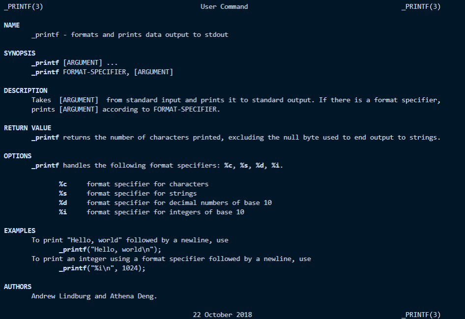

# printf 
A collaboration between [Athena Deng](https://ad-egg.github.io/) and [Andrew Lindburg](https://atlindburg.github.io/), this was the first team project in the [Holberton School](https://www.holbertonschool.com/) curriculum. After 5 weeks of learning the C programming language, the goal of this project was to create a function that was like the C standard library's `printf` within 5 days.
## The Task
For this project we had to write a function that produced output according to a format.
- Function prototype: `int _printf(const char *format, ...);`
- Return: the number of characters printed (excluding the null byte used to end output to strings).
- Write output to stdout, which is the standard output stream.
- `format` is a character string. The format string is composed of zero or more directives. See `man 3 printf` for more detail.
- The following conversion specifiers are handled:
	- %c
	- %s
	- %d
	- %i
- We did not have to reproduce the buffer handling of the C library `printf` function.
- We did not have to handle the flag characters.
- We did not have to handle field width.
- We did not have to handle precision.
- We did not have to handle the length modifiers.
- We may not have more than 5 functions per file.
- Each function must end with a newline.
- Global variables are not allowed.
- All files use the `Betty` style and were checked using [betty-style.pl](https://github.com/holbertonschool/Betty/blob/master/betty-style.pl) and [betty-doc.pl](https://github.com/holbertonschool/Betty/blob/master/betty-doc.pl).
- The executable compiled from all of the `.c` files prints to standard output the formatted arguments that were passed to the `_printf` function.
- Authorized functions and macros for this project are:
	- `write (man 2 write)`
	- `malloc (man 3 malloc)`
	- `free (man 3 free)`
	- `va_start (man 3 va_start)`
	- `va_end (man 3 va_end)`
	- `va_copy (man 3 va_copy)`
	- `va_arg (man 3 va_arg)`

## Challenges
- managing dynamically allocated memory
- handling unexpected user input like `%%c` or `%                 i`
## man_3_printf
This is the manual page for our `_printf` function.

## How to use
- All of the `.c` files along with a `main.c` file are to be compiled with `gcc 4.8.4` on Ubuntu 14.04 LTS with the flags `-Wall` `Werror` `-Westra` and `-pedantic`.
- The files will be compiled this way:
```
$ gcc -Wall -Werror -Wextra -pedantic *.c
```

In the `main.c` file, use the `_printf` function like so:
```
$ cat main.c
#include "holberton.h"

/**
 * main - main function of program
 * Return: always 0
 */
int main(void)
{
	int num;
	char *string;
	
	num = 12;
	string = "Hello, world!"
	_printf("%s I am not %i years old!\n", string, num);
	return (0);
}
$ gcc -Wall -Werror -Wextra -pedantic *.c -o myprogram
$ ./myprogram
Hello, world! I am not 12 years old!
$ 
```
## Contributors
- [Athena Deng](https://ad-egg.github.io/)
- [Andrew Lindburg](https://atlindburg.github.io/)
